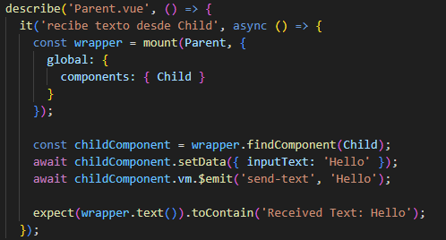

- [Desafío Prueba desarrollo de aplicaciones frontend](#desafío-prueba-desarrollo-de-aplicaciones-frontend)
  - [Requerimientos](#requerimientos)
  - [Pasos](#pasos)
  - [Resultado](#resultado)

# Desafío Prueba desarrollo de aplicaciones frontend

- Descripción

Aplicando los conceptos y herramientas aprendidas hasta ahora deberás desarrollar un
conjunto de ejercicios que componen esta prueba. Para lograrlo deberás contemplar las
siguientes generalidades:
1. Utilizar el CLI de Vue JS para integrar las dependencias de Vue Router, Vuex y Pruebas
unitarias con Jest.
2. Cada ejercicio que se plantea debe estar resuelto en un componente específico.
3. Documentar el código con comentarios que evidencien tus explicaciones y lógica
implementada.

  ---

## Requerimientos

1. Ejercicio 1 - Manejo del estado con Vuex En este ejercicio deberán configurar Vuex
para gestionar el estado de un contador donde se deberá incrementar y decrementar
su valor. Dicho valor partirá por defecto en 0. Además, deberás aplicar pruebas
unitarias para:
a. Verificar que se reciba un valor inicial en el contador.
b. Probar la funcionalidad de incremento y decremento del contador.

2. Ejercicio 2 - Navegación con Vue Router: Al crear la aplicación con Vue Router
mediante CLI se nos crean por defecto algunas vistas. El objetivo de este ejercicio es
que puedas validar mediante pruebas unitarias la existencia de componentes que
controlen cada una de las vistas.

3. Ejercicio 3 - Comunicación entre componentes: Para este ejercicio deberán existir dos
componentes, los cuales se pueden llamar Parent.vue y Child.vue. El objetivo de
este ejercicio es que el componente Child va a tener un campo de ingreso de texto y
un botón. Al dar clic en el botón el texto del input será enviado al Parent y este mostrará
en pantalla el resultado. Además, deberás generar una prueba que permita validar que
al dar clic sobre el botón del componente Child, se envíe algún texto.

4. Por último, genera el build de producción y súbelo utilizando Firebase Hosting.

   ---

## Pasos

1. Manejamos el estado con Vuex En este ejercicio debemos configurar Vuex
para gestionar el estado de un contador

2. creamos la aplicación con Vue Router
mediante CLI y validamos mediante pruebas unitarias la existencia de componentes que
controlen cada una de las vistas

3. el componente Child va a tener un campo de ingreso de texto y
un botón. Al dar clic en el botón el texto del input será enviado al Parent y este mostrará
en pantalla el resultado

4. Por último, generamos el build de producción y lo súbimos utilizando Firebase Hosting

---

## Resultado

